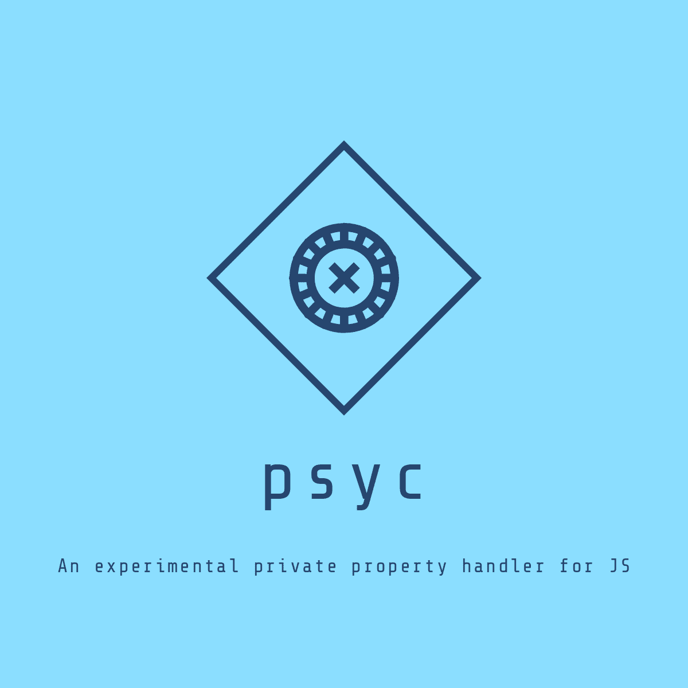

<p align="center">
  
</p>

## Welcome to psyc! ✨

We all know that JS does not support private properties yet, but can simulate their behaviour in a variety of ways.

This package is meant to do that by using Symbols. That way we can achieve some kind of private property, with setter and getter methods for our classes. 👻

### How can I use the package? 🛠

Here's the magic! Just install the package with npm like this:

`npm i psyc`

That's all! You can now import the package and test it our with some classes. Here's a full example:

```
import { addPrivate } from 'psyc';

class Animal {
  constructor(name) {
    this.name = name;
  }
}

const animal = new Animal('dog');

// Create the new private property by using the addPrivate function
// and assing it to a variable
const _legs = addPrivate(animal, 'legs', 4);

// Will access the private property
console.log(animal[_legs]);

// Won't access the private propery
console.log(animal._legs);

// Won't work even when creating a new Symbol with the same base string
const _newLegs = Symbol('legs');
console.log(animal[_newLegs]);

// This is the way to break through the Symbol property
const _privateLegs = Object.getOwnPropertySymbols(animal)[0];
console.log(animal[_privateLegs])

// A getPrivate method is added to the class when calling the addPrivate function
console.log(animal.getPrivate(_legs));

// A setPrivate method is added too, so we can change the property
animal.setPrivate(_legs, 10);
console.log(animal.getPrivate(_legs));
```

As easy and simple as shown! 🔝

Just remember! The class will have a private like property, both a `getPrivate` and a `setPrivate` method for accessing or setting the values if needed!
